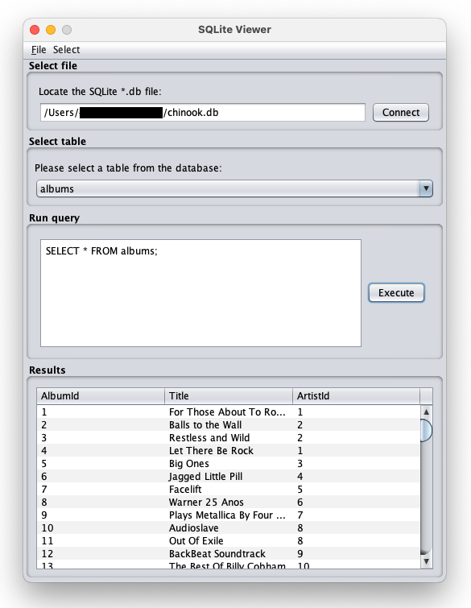

# sqlite Viewer

A desktop application to view and edit sqlite databases. It is written in Java and uses the sqlite JDBC driver.

## Requirements

- JRE 11 or higher to run the application
- JDK 11 or higher to compile the application

## Install

- [Download](https://github.com/dan-koller/sqlite-viewer/releases/tag/v1.2.0) the .jar file from the release section
  _or_
- [Clone](https://github.com/dan-koller/sqlite-viewer) this repository and compile it yourself using `./gradlew build`

## Usage

- Load a Sqlite `*.db` file from disk from the menu
- Open it by clicking `Connect`
- Select the table you want to edit or view
- Enter a SQL query in the text area and click `Execute` to run it
- See the result in the area below

_To get started you can download a sample file from
sqlitetutorial.net [here](https://www.sqlitetutorial.net/sqlite-sample-database/)._

## Known issues

- On **Unix-like** systems, double-clicking the jar file does not work in certain directory structures. In this case, you
  can run the jar file from the command line using `java -jar sqlite-viewer.jar` or place the jar file somewhere else.

_Unix-like systems like **Linux** and **macOS** are - unlike Windows - using the home directory as the current working directory
when double-clicking a jar file._

## Technologies

- Java 11
- Gradle 7.4.1
- sqlite 3

## License

This project is licensed under the MIT License - see the [LICENSE](LICENSE) file for details.
